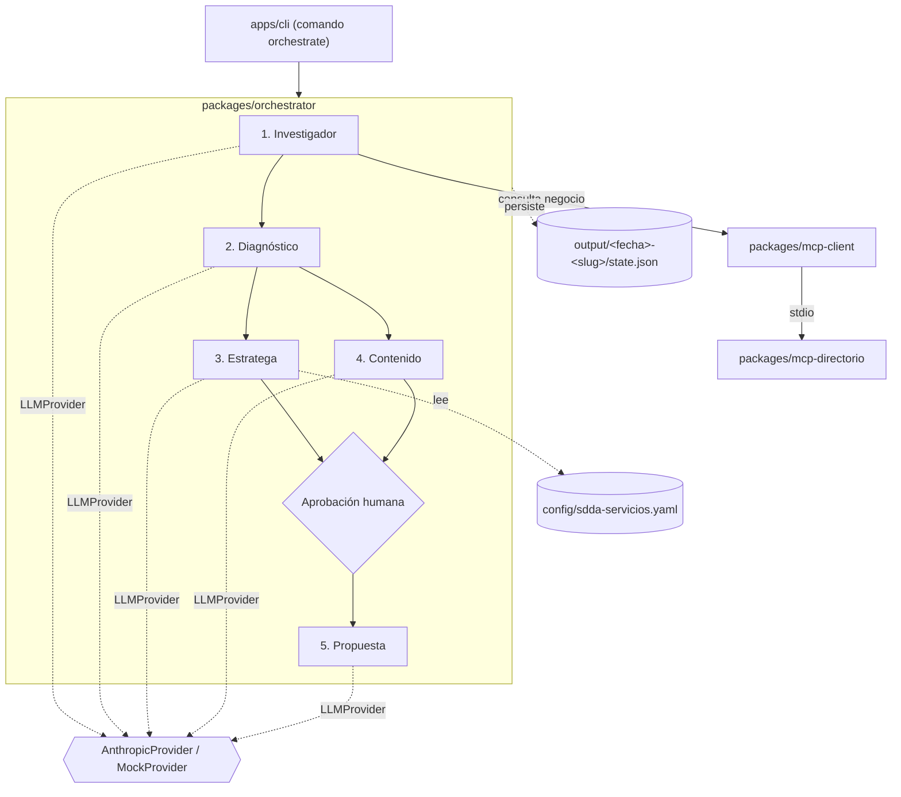

# Acámbaro AI Orchestrator

> Un comando, cinco agentes: convierte los datos de un negocio local de Acámbaro, Gto., en un diagnóstico de presencia digital, una recomendación de servicio SDDA y contenido listo para revisión humana.
> Cada salida se valida con zod antes de tocar disco, y un tope de gasto (`MAX_USD_PER_RUN`) se verifica antes de cada llamada al modelo — nunca después.
> Construido por [Armando Tapia](https://github.com/atapia9) para **SDDA — Servicios Digitales de Acámbaro**, la marca de consultoría de Acambaro.com.mx.

**Demo interactiva:** [`docs/index.html`](docs/index.html) — pipeline de los 5 agentes, métricas reales y la corrida `--live` completa, listo para publicarse en GitHub Pages (Settings → Pages → Deploy from a branch → `main` / `/docs`).

**Estado:** MVP1 completo (Fases 0-5, ver el [informe de cierre](docs/CIERRE-MVP1.md)). MVP2 en curso: el directorio ya puede poblarse con negocios reales de Acámbaro vía la API DENUE del INEGI (`pnpm importar-denue`, ver [`packages/mcp-directorio/data/inegi/README.md`](packages/mcp-directorio/data/inegi/README.md)). Detalle y siguientes pasos en [`docs/ROADMAP.md`](docs/ROADMAP.md).

## Arquitectura



Detalle completo (paquetes, dependencias, decisiones clave) en [`docs/ARCHITECTURE.md`](docs/ARCHITECTURE.md).

## Instalación

```bash
git clone https://github.com/atapia9/aca-ai-orchestrator.git
cd aca-ai-orchestrator
pnpm install
pnpm build
cp .env.example .env   # ANTHROPIC_MODEL y MAX_USD_PER_RUN ya traen un valor por defecto
```

Requiere Node `^22.12.0 || ^24.0.0 || >=26.0.0` y pnpm ≥10.

## Uso

Sin API key ni costo — `--dry-run` usa respuestas fijas (`ProveedorDemo`):

```bash
pnpm orchestrate diagnostico --manual samples/negocio-ejemplo.json --dry-run --auto
```

Con la API real de Anthropic (usa `ANTHROPIC_API_KEY` de `.env`; pide aprobación antes del paso 5):

```bash
pnpm orchestrate diagnostico --negocio "<id-o-nombre-del-directorio>"
# o, con datos capturados a mano en vez del directorio MCP:
pnpm orchestrate diagnostico --manual ./samples/negocio-ejemplo.json
```

Flags principales: `--auto` (omite la aprobación humana), `--resume <carpeta>` (continúa una corrida interrumpida sin repetir pasos ya completados ni su costo).

### Qué produce

Cada corrida escribe en `output/<fecha>-<slug>/`:

1. `01-ficha.md` — ficha normalizada del negocio.
2. `02-diagnostico.md` — puntaje 0-100 por dimensión, con hallazgos y quick wins; distingue dato verificado de supuesto.
3. `03-recomendacion.md` — servicio recomendado de la escalera SDDA, con justificación.
4. `04-contenido.md` — 3 publicaciones de redes sociales listas para revisión.
5. `05-propuesta.md` — propuesta comercial en Markdown.
6. `run-summary.json` — tokens y costo real por agente, duración total.

Un ejemplo real (corrida `--live` contra la API de Anthropic, negocio ficticio) está en [`docs/demo/taller-mecanico-el-tornillo-feliz/`](docs/demo/taller-mecanico-el-tornillo-feliz/) — costó $0.0615 USD y tardó ~42 s.

## Estructura del monorepo

```
apps/cli/                 Punto de entrada: comando `orchestrate`
packages/core/            Tipos de dominio, esquemas zod, config, LLMProvider
packages/mcp-directorio/  Servidor MCP del directorio de negocios (migrado, historial conservado; ahora con importador de datos reales vía DENUE)
packages/mcp-client/      Cliente tipado hacia el MCP del directorio
packages/agents/          Los 5 agentes especializados
packages/orchestrator/    Grafo de ejecución, estado, aprobación humana
packages/evals/           Corredor de evaluación (`pnpm eval`)
config/                   Escalera de servicios SDDA (YAML editable)
samples/                  Negocios ficticios de ejemplo
evals/                    Casos de evaluación (negocios ficticios + criterios verificables)
docs/                     Arquitectura, ADRs, roadmap, demo
```

## Desarrollo

```bash
pnpm install
pnpm build
pnpm lint && pnpm typecheck && pnpm test
pnpm eval          # evals en modo mock
pnpm eval --live   # evals contra la API real - gasta dinero de verdad
```

Ver [`CLAUDE.md`](CLAUDE.md) para las convenciones del repo.

## Roadmap

MVP1 (Fases 0-5) está completo. De MVP2:

- ✅ **Datos reales del directorio (DENUE)** — `pnpm importar-denue` ya está verificado contra la API real del INEGI (miles de candidatos reales para Acámbaro). Falta completar a mano, por negocio y con su consentimiento, los campos que DENUE no trae antes de pasar alguno al directorio en vivo.
- 🔜 Branch protection sobre el check de CI, API HTTP/panel web, publicación directa a WhatsApp/Meta/Google Business, y endurecer un par de heurísticas conocidas.

Detalle completo en [`docs/ROADMAP.md`](docs/ROADMAP.md).

## Licencia

MIT — ver [`LICENSE`](LICENSE).
