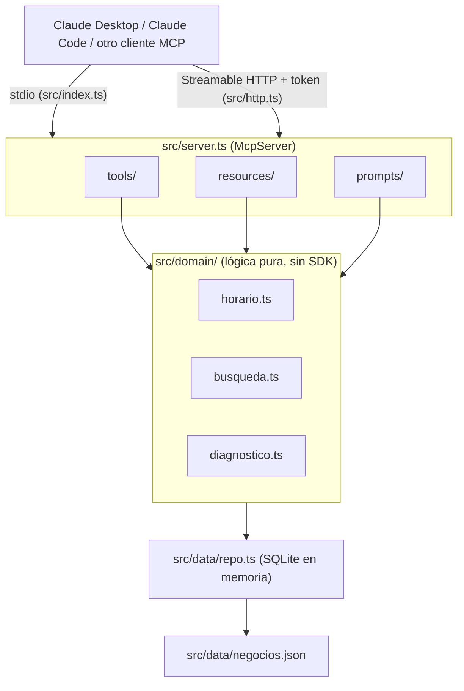

# MCP Directorio Acámbaro

[](https://github.com/atapia9/mcp-directorio-acambaro/actions/workflows/ci.yml)
[](LICENSE)
[](package.json)
[](https://github.com/atapia9/mcp-directorio-acambaro/releases)

> Servidor **Model Context Protocol** en TypeScript que permite a asistentes de IA buscar negocios locales de Acámbaro, Guanajuato, y generar un diagnóstico de presencia digital vinculado a los servicios de SDDA.

## Resumen
**Qué es:** un MCP que conecta el directorio de Acambaro.com.mx con Claude.
**Pasos:** esqueleto → datos y lógica → tools/resources/prompts → pruebas y CI → despliegue en OCI → vitrina de portafolio.

## Arquitectura



## Documentación
| Archivo | De qué trata |
|---|---|
| [`docs/00-VISION-Y-ALCANCE.md`](docs/00-VISION-Y-ALCANCE.md) | Por qué, para quién, alcance y criterios de éxito |
| [`docs/01-ARQUITECTURA.md`](docs/01-ARQUITECTURA.md) | Stack, capacidades MCP, modelo de datos, estructura |
| [`docs/02-ROADMAP.md`](docs/02-ROADMAP.md) | Fases y checklist de construcción |
| [`docs/03-DESPLIEGUE.md`](docs/03-DESPLIEGUE.md) | Despliegue en OCI A1 detrás de Cloudflare (Docker o systemd) |
| [`CLAUDE.md`](CLAUDE.md) | Instrucciones para Claude Code |

## Capacidades (v0.2)
- **Tools:** `buscar_negocios`, `detalle_negocio`, `negocios_abiertos`, `diagnostico_digital`
- **Resources:** `directorio://categorias`, `sdda://servicios`
- **Prompts:** `recomendar_negocio`, `propuesta_sdda`
- **Transportes:** stdio (`src/index.ts`) para Claude Desktop/Code, y Streamable HTTP con token por header (`src/http.ts`) para despliegue remoto.
- **Datos:** 21 negocios ficticios en 11 categorías, servidos desde SQLite (`src/data/repo.ts`).

## Instalación en 5 minutos

```bash
git clone https://github.com/atapia9/mcp-directorio-acambaro
cd mcp-directorio-acambaro
npm install
npm run build
```

**Probarlo sin ningún cliente**, con MCP Inspector:
```bash
npm run inspect
```

**Conectarlo a Claude Desktop**, agregando esto a tu `claude_desktop_config.json`
(o desde Settings → Conectores/MCP si tu versión de la app lo gestiona ahí):
```json
{
  "mcpServers": {
    "directorio-acambaro": {
      "command": "node",
      "args": ["/ruta/absoluta/a/mcp-directorio-acambaro/dist/index.js"]
    }
  }
}
```

**Modo HTTP** (para desplegarlo, ver [`docs/03-DESPLIEGUE.md`](docs/03-DESPLIEGUE.md)):
```bash
MCP_TOKEN="un-token-largo-y-aleatorio" PORT=3000 npm run start:http
```

## Autor
**Armando Tapia** — Acambaro.com.mx · SDDA · [GitHub @atapia9](https://github.com/atapia9)

## Licencia
MIT
