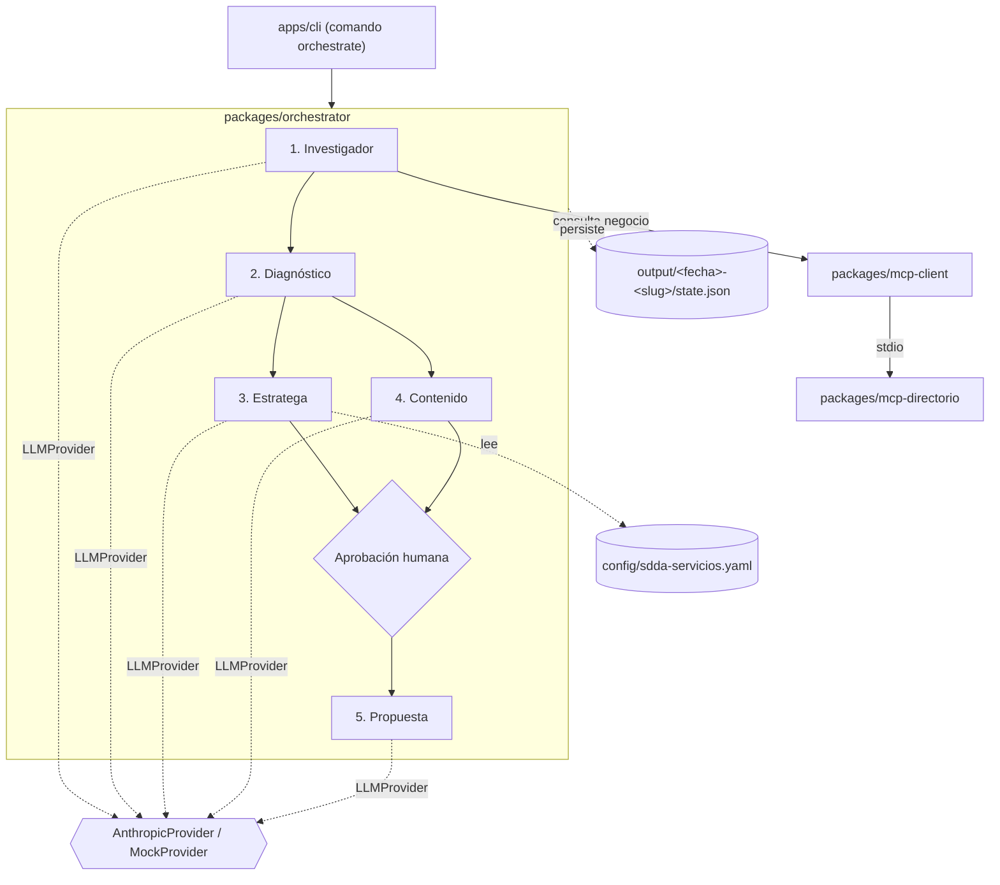

# Arquitectura

## Visión general

## Paquetes

| Paquete                   | Responsabilidad                                                                                                      | Depende de               |
| ------------------------- | -------------------------------------------------------------------------------------------------------------------- | ------------------------ |
| `apps/cli`                | Parseo de comandos y flags (`--negocio`, `--manual`, `--auto`, `--dry-run`, `--resume`)                              | `orchestrator`           |
| `packages/orchestrator`   | Grafo de ejecución (1→2→(3∥4)→5), estado, reanudación, punto de aprobación humana, resumen de costo/tokens           | `agents`, `core`         |
| `packages/agents`         | Los 5 agentes, cada uno con prompt versionado (`.md`), esquema zod de entrada/salida, `run(input, ctx)`              | `core`, `mcp-client`     |
| `packages/core`           | Tipos de dominio (zod), `LLMProvider` (+ `AnthropicProvider`, `MockProvider`), carga de config/YAML, logger, errores | —                        |
| `packages/mcp-client`     | Wrapper tipado sobre el MCP del directorio (levanta el servidor por stdio)                                           | `mcp-directorio`, `core` |
| `packages/mcp-directorio` | Servidor MCP del directorio de negocios (migrado desde `mcp-directorio-acambaro`, historial conservado)              | —                        |

## Los 5 agentes

| #   | Agente       | Entrada                             | Salida                                                   |
| --- | ------------ | ----------------------------------- | -------------------------------------------------------- |
| 1   | Investigador | id o datos del negocio              | Ficha normalizada (vía MCP)                              |
| 2   | Diagnóstico  | Ficha                               | Puntuación 0-100 por dimensión + hallazgos + quick wins  |
| 3   | Estratega    | Diagnóstico + `sdda-servicios.yaml` | Servicio recomendado + justificación                     |
| 4   | Contenido    | Ficha + diagnóstico                 | 3 publicaciones (Facebook / Instagram / WhatsApp Status) |
| 5   | Propuesta    | Todo lo anterior                    | Propuesta comercial en Markdown                          |

Los pasos 3 y 4 corren en paralelo. Antes del paso 5 hay un punto de aprobación humana en la CLI (omitible con `--auto`).

## Decisiones clave

- **Proveedor de LLM intercambiable:** interfaz `LLMProvider`; `AnthropicProvider` (real) y `MockProvider` (fixtures fijas). Los tests nunca llaman a la API real.
- **Salidas estructuradas:** tool use / JSON, validadas con zod; un reintento con el error de validación adjunto y luego error controlado.
- **MCP vía stdio:** el orquestador levanta `mcp-directorio` como proceso hijo; sin transporte HTTP en este MVP.
- **Estado y reanudación:** cada paso persiste en `output/<fecha>-<slug>/state.json`; `--resume <carpeta>` continúa desde el último paso exitoso.
- **Límite de gasto:** `MAX_USD_PER_RUN` (por defecto 0.50 USD); el orquestador se detiene antes de la siguiente llamada si la estimación lo rebasaría.
- **Dato verificado vs. supuesto:** el agente de Diagnóstico distingue explícitamente entre lo que viene del directorio/captura y lo que el modelo asume.

## Fuera de alcance del MVP1

Ver [`docs/ROADMAP.md`](ROADMAP.md).
